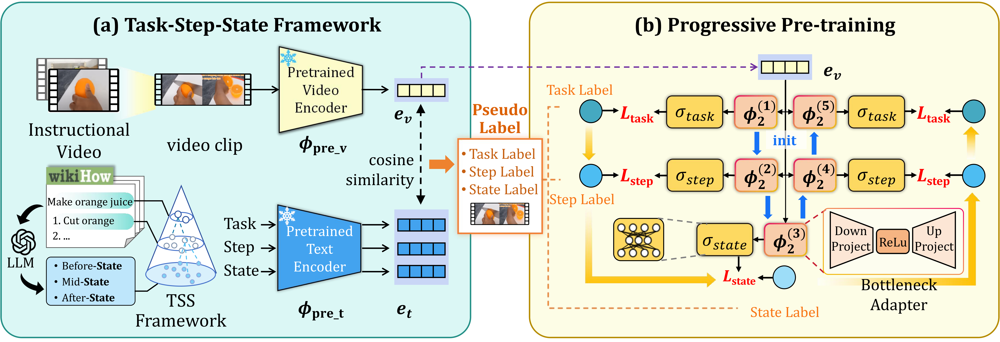

# [AAAI-2026] Learning Procedural-aware Video Representations through State-Grounded Hierarchy Unfolding

**Jinghan Zhao**1, **Yifei Huang**2, **Feng Lu**1,*

1Beihang University, 2The University of Tokyo

---

## 📢 News
*   **[2025-11-26]** 🚧 The code is currently being organized and will be released **within this week**. Stay tuned!
*   **[2025-11-08]** 🎉 Our paper has been accepted by **AAAI 2026**!

## 📝 Introduction

This repository contains the official implementation of the paper: **"Learning Procedural-aware Video Representations through State-Grounded Hierarchy Unfolding"**.

> **Abstract:** *Learning procedural-aware video representations is a key step towards building agents that can reason about and execute complex tasks. Existing methods typically address this problem by aligning visual content with textual descriptions at the task and step levels to inject procedural semantics into video representations. However, due to their high level of abstraction, 'task' and 'step' descriptions fail to form a robust alignment with the concrete, observable details in visual data. To address this, we introduce 'states', i.e., textual snapshots of object configurations, as a visually-grounded semantic layer that anchors abstract procedures to what a model can actually see. We formalize this insight in a novel Task-Step-State (TSS) framework, where tasks are achieved via steps that drive transitions between observable states. To enforce this structure, we propose a progressive pre-training strategy that unfolds the TSS hierarchy, forcing the model to ground representations in states while associating them with steps and high-level tasks. Extensive experiments on the COIN and CrossTask datasets show that our method outperforms baseline models on multiple downstream tasks, including task recognition, step recognition, and next step prediction. Ablation studies show that introducing state supervision is a key driver of performance gains across all tasks. Additionally, our progressive pretraining strategy proves more effective than standard joint training, as it better enforces the intended hierarchical structure.*

*Figure: The overall architecture of our proposed method.*

## 🗓️ TODO
- [ ] Release core code (Training & Inference)
- [ ] Release pre-trained models
- [ ] Provide training scripts and documentation
